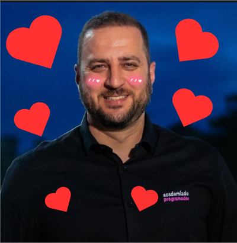

# 🚀 Os Gadeias

## A dupla que vai bater de frente com DotSisters, PingDev e Os netos do Velho Barreiro - 
## OS GADEIAS - da Curso _Academia do Programador_!

## 👥 A Dupla

Projetos construídos colaborativamente pelos integrantes abaixo:

- **Thiago Kovalski**
  - [Thig0S GitHub](https://github.com/Thig0S)
- **Victor Jeremias**
  - [VictorJer GitHub](https://github.com/VictorJer)

---

## 🛠️ Tecnologias Utilizadas

- **Linguagem:** C# (.NET, ASP.NET)
- **Banco de Dados:** [SQL Server]
- **Tecnologias:** Dapper, Entity, SeriLog, NewRelic
- **Arquitetura:** [Arquiterura de 3 camadas, utilizando MVC]

---

## 🎯 Sobre a Dupla

  **08/07/2026 - Alexandre Rech The Greatest compareceu a call e deu a notícia oficial que OS GADEIAS sairam do papel**
 
  

---

## 📝 Lições Aprendidas

Durante o desenvolvimento deste módulo na **Academia do Programador**, focamos em:

- Aplicação de padrões de projeto e boas práticas de SOLID.
- Manipulação de dados relacionais com Dapper/Entity.
- Trabalho em dupla utilizando Git (Branching, Pull Requests e Code Review).

---

> Desenvolvido com amor e dedicação na **Academia do Programador**.
